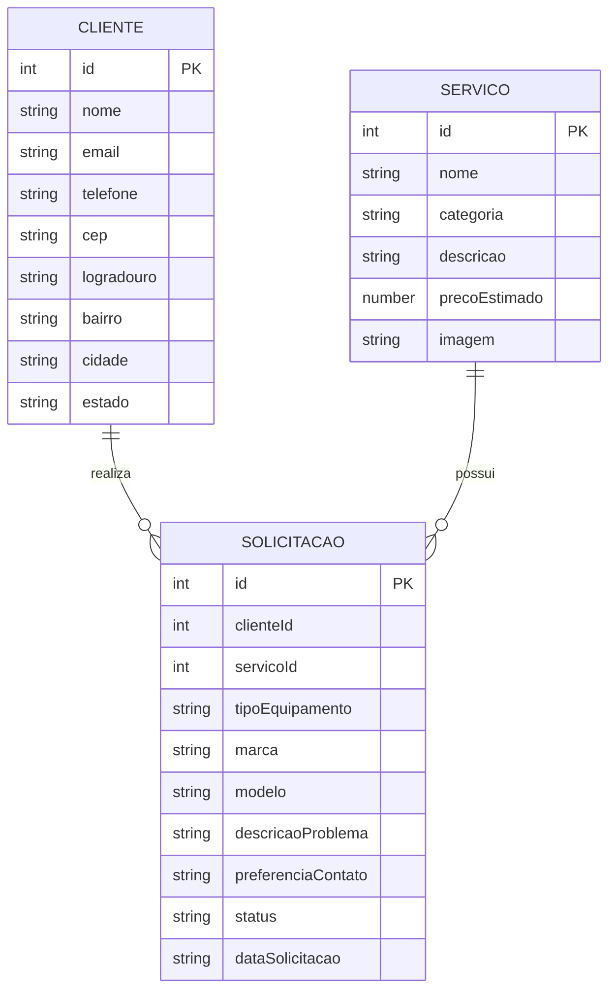

# Software Design Document — TechFix

## 1. Introdução

Este documento descreve a arquitetura técnica planejada para o **TechFix**, uma aplicação web responsiva destinada à consulta de serviços e ao cadastro de solicitações de manutenção de computadores.

O documento apresenta:

* Arquitetura da aplicação;
* Tecnologias utilizadas;
* Framework CSS;
* Bibliotecas JavaScript;
* Design System;
* Design Tokens;
* Entidades;
* Modelo de dados;
* Contratos da API;
* Organização do projeto;
* Estratégia de responsividade.

---

# 2. Visão Geral da Arquitetura

O TechFix será uma aplicação predominantemente **client-side**.

A interface será executada diretamente no navegador e será responsável por realizar as validações, manipular o DOM, armazenar informações temporárias e se comunicar com APIs externas.

```text
                    ┌─────────────────────┐
                    │       Usuário       │
                    └──────────┬──────────┘
                               │
                               ▼
                    ┌─────────────────────┐
                    │   HTML + Bootstrap  │
                    │      Interface      │
                    └──────────┬──────────┘
                               │
                               ▼
                  ┌─────────────────────────┐
                  │ JavaScript ES6+ / jQuery│
                  └────────────┬────────────┘
                               │
             ┌─────────────────┼─────────────────┐
             │                 │                 │
             ▼                 ▼                 ▼
      Web Storage        JSON Server          ViaCEP
      Persistência        API Fake          API Pública
         local
```

---

# 3. Tecnologias

## 3.1 HTML5

HTML5 será utilizado para construir a estrutura semântica das páginas.

Serão utilizados elementos como:

```text
header
nav
main
section
article
form
footer
```

---

## 3.2 CSS3

CSS personalizado será utilizado para complementar o Bootstrap e implementar características específicas da identidade visual.

Também será utilizado para aplicar:

* CSS Grid;
* Flexbox;
* Media queries;
* Unidades relativas;
* Tipografia fluida;
* Imagens responsivas.

---

## 3.3 Bootstrap 5

O Framework CSS escolhido é o **Bootstrap 5**.

### Motivos da escolha

* Sistema de Grid responsivo;
* Abordagem mobile-first;
* Grande quantidade de componentes;
* Boa documentação;
* Facilidade de utilização;
* Suporte a componentes JavaScript;
* Possibilidade de utilização por CDN.

### Recursos previstos

* Grid;
* Flexbox;
* Containers;
* Spacing utilities;
* Navbar;
* Cards;
* Buttons;
* Forms;
* Alerts;
* Modal;
* Tables;
* Badges.

---

# 4. Componentes do Framework

Pelo menos três elementos presentes no protótipo serão posteriormente substituídos por componentes prontos do Bootstrap.

## 4.1 Navbar

Será utilizada para a navegação principal.

Páginas disponíveis:

* Home;
* Serviços;
* Solicitar manutenção;
* Solicitações.

---

## 4.2 Cards

Serão utilizados principalmente para apresentar:

* Serviços;
* Destaques;
* Informações;
* Solicitações.

---

## 4.3 Modal

Será utilizado para situações como:

* Exibição de detalhes de um serviço;
* Confirmação de ações;
* Feedback de operações.

---

# 5. Sass

O projeto utilizará **Sass com sintaxe SCSS** para organização do código de estilo.

Serão utilizados:

* Variáveis;
* Mixins;
* Funções;
* Partials.

Estrutura planejada:

```text
scss/
├── _variables.scss
├── _mixins.scss
├── _components.scss
└── style.scss
```

O arquivo `style.scss` será compilado para:

```text
css/style.css
```

---

# 6. JavaScript

Será utilizado JavaScript Vanilla ES6+.

Principais responsabilidades:

* Manipulação do DOM;
* Eventos;
* Validação;
* Web Storage;
* Comunicação com APIs;
* Renderização dinâmica;
* Manipulação de objetos JSON;
* Tratamento de erros.

Serão utilizados recursos modernos como:

```text
const
let
arrow functions
template literals
fetch
Promise
async
await
try
catch
```

---

# 7. jQuery

O jQuery será utilizado em funcionalidades específicas da aplicação.

Possíveis usos:

* Eventos;
* Pesquisa de serviços;
* Filtros;
* Manipulação de elementos;
* Alteração de classes;
* Pequenas animações.

---

# 8. jQuery Mask Plugin

Será utilizado o **jQuery Mask Plugin** para aplicar máscaras em campos do formulário.

## Telefone

```text
(00) 00000-0000
```

## CEP

```text
00000-000
```

---

# 9. Node.js e NPM

Node.js e NPM serão utilizados no ambiente de desenvolvimento.

Principais responsabilidades:

* Gerenciamento de dependências;
* Execução do JSON Server;
* Compilação do Sass;
* ESLint;
* Prettier.

---

# 10. API Fake — JSON Server

O **JSON Server** será utilizado para simular uma API REST.

Arquivo principal:

```text
db.json
```

Estrutura inicial:

```json
{
  "services": [],
  "requests": []
}
```

Os dois recursos principais serão:

```text
/services
/requests
```

---

# 11. API Pública — ViaCEP

A API pública utilizada será a **ViaCEP**.

Ela permitirá consultar automaticamente informações de endereço utilizando um CEP brasileiro.

## Fluxo

```text
Usuário informa o CEP
        ↓
JavaScript valida o valor
        ↓
fetch()
        ↓
API ViaCEP
        ↓
Resposta JSON
        ↓
Preenchimento do formulário
```

Dados utilizados:

* Logradouro;
* Bairro;
* Localidade;
* UF.

---

# 12. Tratamento de Erros

As chamadas às APIs deverão possuir tratamento de erro.

Estrutura prevista:

```javascript
try {
    // requisição
} catch (error) {
    // tratamento do erro
}
```

Situações possíveis:

* CEP inválido;
* CEP inexistente;
* Falha de conexão;
* JSON Server indisponível;
* Erro ao cadastrar uma solicitação;
* Erro ao carregar dados.

---

# 13. Design System

O Design System do TechFix deverá transmitir:

* Tecnologia;
* Confiança;
* Organização;
* Simplicidade;
* Clareza.

A identidade visual deverá permanecer consistente em todas as páginas.

---

# 14. Design Tokens

## 14.1 Paleta de Cores

### Primary

```text
#2563EB
```

Utilização:

* Botões principais;
* Links;
* Elementos de destaque;
* Elementos interativos.

### Primary Dark

```text
#1D4ED8
```

Utilização:

* Estados hover;
* Elementos de maior contraste.

### Secondary

```text
#475569
```

Utilização:

* Textos e componentes secundários.

### Background

```text
#F8FAFC
```

Utilização:

* Fundo principal da aplicação.

### Surface

```text
#FFFFFF
```

Utilização:

* Cards;
* Formulários;
* Modais.

### Text Primary

```text
#0F172A
```

### Text Secondary

```text
#64748B
```

### Success

```text
#16A34A
```

### Warning

```text
#F59E0B
```

### Danger

```text
#DC2626
```

> Os valores poderão ser refinados após a finalização do protótipo no Google Stitch.

---

# 15. Tokens em SCSS

```scss
$color-primary: #2563eb;
$color-primary-dark: #1d4ed8;
$color-secondary: #475569;

$color-background: #f8fafc;
$color-surface: #ffffff;

$color-text-primary: #0f172a;
$color-text-secondary: #64748b;

$color-success: #16a34a;
$color-warning: #f59e0b;
$color-danger: #dc2626;
```

---

# 16. Tipografia

A fonte principal planejada é:

**Inter**

Fallback:

```css
font-family: "Inter", Arial, sans-serif;
```

---

# 17. Escala Tipográfica

```scss
$font-size-sm: 0.875rem;
$font-size-base: 1rem;
$font-size-lg: 1.25rem;
$font-size-xl: 2rem;
```

Os títulos poderão utilizar tipografia fluida:

```css
.hero-title {
    font-size: clamp(2rem, 5vw, 4rem);
}
```

---

# 18. Espaçamento

```scss
$spacing-xs: 0.25rem;
$spacing-sm: 0.5rem;
$spacing-md: 1rem;
$spacing-lg: 2rem;
$spacing-xl: 4rem;
```

As unidades relativas deverão ser priorizadas.

Serão utilizados principalmente:

```text
rem
em
%
vw
vh
```

---

# 19. Bordas

```scss
$radius-sm: 0.375rem;
$radius-md: 0.75rem;
$radius-lg: 1rem;
```

---

# 20. Responsividade

A aplicação seguirá uma abordagem **mobile-first**.

O protótipo deverá possuir pelo menos duas versões:

* Mobile;
* Desktop.

A maior parte da responsividade será implementada utilizando o Bootstrap.

Também serão implementadas partes do layout utilizando CSS puro através de:

```css
display: flex;
```

e:

```css
display: grid;
```

---

# 21. Imagens Responsivas

As imagens deverão possuir comportamento responsivo.

Exemplo:

```css
img {
    max-width: 100%;
    height: auto;
}
```

Cards poderão utilizar:

```css
.service-card img {
    width: 100%;
    aspect-ratio: 16 / 9;
    object-fit: cover;
}
```

---

# 22. Otimização de Imagens

As imagens principais deverão preferencialmente utilizar o formato:

```text
WebP
```

Quando necessário, serão utilizados recursos como:

```html
<picture>
```

e:

```html
srcset
```

---

# 23. Web Storage

O Web Storage será utilizado para armazenar temporariamente dados do formulário de solicitação.

Chave planejada:

```text
techfix_request_draft
```

Exemplo:

```json
{
  "nome": "João Silva",
  "email": "joao@email.com",
  "telefone": "(42) 99999-9999"
}
```

---

# 24. Modelo de Dados

O projeto possuirá três entidades conceituais principais:

* Cliente;
* Serviço;
* Solicitação.



---

# 25. Entidade Cliente

Representa a pessoa que solicita um atendimento.

| Campo      | Tipo   | Obrigatório |
| ---------- | ------ | ----------- |
| id         | number | Sim         |
| nome       | string | Sim         |
| email      | string | Sim         |
| telefone   | string | Sim         |
| cep        | string | Sim         |
| logradouro | string | Sim         |
| bairro     | string | Sim         |
| cidade     | string | Sim         |
| estado     | string | Sim         |

---

# 26. Entidade Serviço

Representa um serviço disponibilizado pela assistência.

| Campo         | Tipo   | Obrigatório |
| ------------- | ------ | ----------- |
| id            | number | Sim         |
| nome          | string | Sim         |
| categoria     | string | Sim         |
| descricao     | string | Sim         |
| precoEstimado | number | Não         |
| imagem        | string | Não         |

---

# 27. Entidade Solicitação

Representa uma solicitação de manutenção.

| Campo              | Tipo   | Obrigatório |
| ------------------ | ------ | ----------- |
| id                 | number | Sim         |
| clienteId          | number | Sim         |
| servicoId          | number | Sim         |
| tipoEquipamento    | string | Sim         |
| marca              | string | Sim         |
| modelo             | string | Não         |
| descricaoProblema  | string | Sim         |
| preferenciaContato | string | Sim         |
| status             | string | Sim         |
| dataSolicitacao    | string | Sim         |

---

# 28. Contratos da API Fake

## GET `/services`

Retorna todos os serviços cadastrados.

### Exemplo

```json
[
  {
    "id": 1,
    "nome": "Formatação",
    "categoria": "Software",
    "descricao": "Formatação e instalação do sistema operacional.",
    "precoEstimado": 120,
    "imagem": "assets/images/formatacao.webp"
  }
]
```

---

## GET `/services/:id`

Retorna um serviço específico.

---

## GET `/requests`

Retorna todas as solicitações cadastradas.

---

## GET `/requests/:id`

Retorna uma solicitação específica.

---

## POST `/requests`

Cria uma nova solicitação.

### Exemplo

```json
{
  "clienteId": 1,
  "servicoId": 1,
  "tipoEquipamento": "Notebook",
  "marca": "Dell",
  "modelo": "Inspiron",
  "descricaoProblema": "Notebook apresenta lentidão.",
  "preferenciaContato": "WhatsApp",
  "status": "Pendente",
  "dataSolicitacao": "2026-08-27"
}
```

---

## DELETE `/requests/:id`

Remove uma solicitação.

Essa funcionalidade será opcional.

---

## PUT `/requests/:id`

Atualiza completamente uma solicitação.

Poderá ser implementado futuramente.

---

## PATCH `/requests/:id`

Atualiza parcialmente uma solicitação.

Poderá ser utilizado futuramente para alterar apenas o status.

---

# 29. Validação de Formulário

O formulário utilizará recursos nativos do HTML.

Exemplos:

```html
required
```

```html
type="email"
```

```html
minlength
```

```html
maxlength
```

```html
pattern
```

Também serão utilizadas expressões regulares em JavaScript.

Campos previstos para validação customizada:

* Telefone;
* CEP.

---

# 30. Organização JavaScript

```text
js/
├── main.js
├── services.js
├── request-form.js
└── requests.js
```

## `main.js`

Responsável pelas funcionalidades compartilhadas entre páginas.

## `services.js`

Responsável por:

* Buscar serviços;
* Renderizar cards;
* Pesquisar;
* Filtrar;
* Abrir detalhes.

## `request-form.js`

Responsável por:

* Validação do formulário;
* Máscaras;
* Web Storage;
* Consulta ViaCEP;
* Envio da solicitação.

## `requests.js`

Responsável por:

* Consultar solicitações;
* Renderizar a listagem;
* Excluir registros, quando implementado.

---

# 31. Estrutura de Diretórios

```text
techfix/
│
├── index.html
├── servicos.html
├── solicitar.html
├── solicitacoes.html
│
├── assets/
│   ├── icons/
│   └── images/
│
├── css/
│   └── style.css
│
├── scss/
│   ├── _variables.scss
│   ├── _mixins.scss
│   ├── _components.scss
│   └── style.scss
│
├── js/
│   ├── main.js
│   ├── services.js
│   ├── request-form.js
│   └── requests.js
│
├── docs/
│   ├── prd.md
│   └── architecture.md
│
├── db.json
├── package.json
├── .gitignore
├── .eslintrc
├── .prettierrc
└── README.md
```

---

# 32. Ferramentas de Qualidade

## ESLint

Será utilizado para identificar problemas e manter padrões de qualidade no JavaScript.

## Prettier

Será utilizado para padronizar automaticamente a formatação dos arquivos do projeto.

---

# 33. Controle de Versão

Será utilizado Git para o controle de versão.

Branch principal:

```text
main
```

Também será utilizado:

```text
.gitignore
```

para evitar o versionamento de arquivos desnecessários.

O GitHub será utilizado para:

* Armazenar o repositório;
* Registrar o histórico do projeto;
* Armazenar a documentação;
* Publicar o frontend.

---

# 34. Deploy

O frontend da aplicação será publicado utilizando **GitHub Pages**.

As dependências utilizadas na aplicação final poderão ser carregadas por CDN quando necessário.

O JSON Server será utilizado principalmente durante o desenvolvimento e demonstração do funcionamento da API fake.

---

# 35. Relação com os Indicadores de Desempenho

| Recurso                    | Indicador |
| -------------------------- | --------: |
| Protótipo mobile e desktop |     ID 01 |
| Bootstrap Grid/Flexbox     |     ID 02 |
| CSS Grid/Flexbox           |     ID 03 |
| Navbar, Cards e Modal      |     ID 04 |
| Unidades relativas         |     ID 05 |
| Design System              |     ID 06 |
| Sass                       |     ID 07 |
| `clamp()` e media queries  |     ID 08 |
| `object-fit`               |     ID 09 |
| WebP e `srcset`/`picture`  |     ID 10 |
| Validação HTML             |     ID 11 |
| Regex                      |     ID 12 |
| Select, Radio e Checkbox   |     ID 13 |
| Web Storage                |     ID 14 |
| Node.js e NPM              |     ID 15 |
| Git e GitHub               |     ID 16 |
| README                     |     ID 17 |
| Organização modular        |     ID 18 |
| ESLint e Prettier          |     ID 19 |
| jQuery                     |     ID 20 |
| jQuery Mask Plugin         |     ID 21 |
| JSON Server POST           |     ID 22 |
| JSON Server GET            |     ID 23 |
| ViaCEP                     |     ID 24 |

---

# 36. Componentes que serão substituídos pelo Bootstrap

Durante a prototipação no Google Stitch deverão ser destacados visualmente pelo menos três componentes que posteriormente serão implementados utilizando Bootstrap.

## Navbar

Componente responsável pela navegação principal.

## Cards de Serviços

Componentes utilizados para apresentar os serviços disponíveis.

## Modal

Componente utilizado para apresentar detalhes, confirmações ou informações adicionais.

Esses três elementos deverão ser apontados durante a apresentação da primeira entrega.
