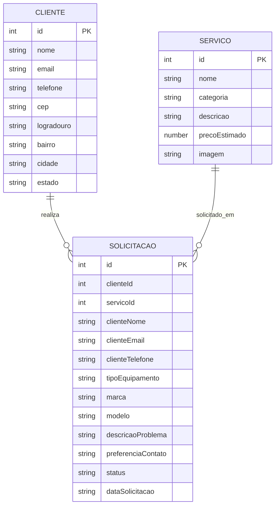

# Software Design Document — TechFix

## 1. Introdução

Este documento descreve a arquitetura técnica do **TechFix**, uma aplicação web responsiva destinada ao cadastro e gerenciamento de solicitações de manutenção de computadores.

A aplicação será predominantemente client-side e utilizará APIs para persistência e obtenção de dados.

---

# 2. Visão Geral da Arquitetura

A estrutura lógica da aplicação será:

```text
                    ┌────────────────────┐
                    │      Usuário       │
                    └─────────┬──────────┘
                              │
                              ▼
                    ┌────────────────────┐
                    │ HTML + Bootstrap   │
                    │     Interface      │
                    └─────────┬──────────┘
                              │
                              ▼
                ┌───────────────────────────┐
                │ JavaScript ES6+ / jQuery  │
                └─────────────┬─────────────┘
                              │
               ┌──────────────┼──────────────┐
               │              │              │
               ▼              ▼              ▼
        LocalStorage     JSON Server       ViaCEP
                         API Fake        API Pública
```

---

# 3. Tecnologias

## HTML5

Será utilizado para estruturar semanticamente as páginas da aplicação.

Elementos previstos:

* `header`;
* `nav`;
* `main`;
* `section`;
* `article`;
* `form`;
* `footer`.

---

## CSS3

Será utilizado para personalizações visuais que não serão realizadas diretamente pelo Bootstrap.

Também será utilizado para demonstrar conhecimentos de:

* CSS Grid;
* Flexbox;
* Unidades relativas;
* Media queries;
* `clamp()`;
* `object-fit`.

---

## Bootstrap 5

O Framework CSS escolhido para o projeto será o **Bootstrap 5**.

### Motivos

* Grande quantidade de componentes;
* Sistema de Grid responsivo;
* Boa documentação;
* Integração simples através de CDN;
* Componentes JavaScript já disponíveis;
* Facilidade para implementação mobile-first.

---

# 4. Componentes Bootstrap

Pelo menos três componentes do protótipo serão posteriormente substituídos pelos componentes oficiais do Bootstrap.

## Navbar

Utilizada como principal elemento de navegação.

---

## Cards

Utilizados para apresentar:

* Serviços;
* Informações da assistência;
* Solicitações.

---

## Modal

Utilizado para:

* Visualizar detalhes;
* Confirmar ações;
* Mostrar informações adicionais.

---

## Outros componentes previstos

* Buttons;
* Forms;
* Alerts;
* Carousel;
* Tables;
* Badges;
* Accordion.

---

# 5. Sass

O projeto utilizará **Sass na sintaxe SCSS**.

O objetivo será melhorar a organização e reaproveitamento do CSS.

Serão utilizados:

* Variáveis;
* Mixins;
* Funções;
* Partials.

Estrutura prevista:

```text
scss/
├── _variables.scss
├── _mixins.scss
├── _components.scss
└── style.scss
```

---

# 6. JavaScript

Será utilizado JavaScript ES6+.

Principais responsabilidades:

* Manipulação dinâmica do DOM;
* Eventos;
* Validação;
* Web Storage;
* Comunicação com APIs;
* Renderização dinâmica;
* Manipulação de dados JSON;
* Tratamento de erros.

---

# 7. jQuery

O jQuery será utilizado em funcionalidades específicas.

Exemplos:

* Pesquisa de serviços;
* Filtragem;
* Eventos;
* Manipulação de elementos;
* Efeitos simples.

---

# 8. jQuery Mask Plugin

Será utilizado o **jQuery Mask Plugin**.

Campos previstos:

### Telefone

```text
(00) 00000-0000
```

### CEP

```text
00000-000
```

---

# 9. Node.js e NPM

Node.js e NPM serão utilizados durante o desenvolvimento.

Principais responsabilidades:

* Gerenciamento de dependências;
* JSON Server;
* Sass;
* ESLint;
* Prettier.

---

# 10. JSON Server

Será utilizado para fornecer uma API REST simulada.

Arquivo principal:

```text
db.json
```

Estrutura inicial:

```json
{
  "services": [],
  "requests": []
}
```

---

# 11. API Pública

A API pública escolhida será:

## ViaCEP

Sua função será obter informações de endereço a partir de um CEP brasileiro.

Fluxo:

```text
Usuário
  ↓
Digita CEP
  ↓
JavaScript valida
  ↓
fetch()
  ↓
ViaCEP
  ↓
Resposta JSON
  ↓
Preenchimento do formulário
```

---

# 12. Tratamento de Erros da API

As requisições utilizarão:

```javascript
try {
    // consulta
} catch (error) {
    // tratamento
}
```

Situações tratadas:

* CEP inválido;
* CEP inexistente;
* Erro de conexão;
* Falha na API.

---

# 13. Design System

O Design System deverá transmitir:

* Tecnologia;
* Organização;
* Confiança;
* Simplicidade;
* Profissionalismo.

---

# 14. Design Tokens

## Cores

### Primary

```text
#2563EB
```

Utilização:

* Botões principais;
* Links;
* Destaques;
* Elementos interativos.

---

### Primary Dark

```text
#1D4ED8
```

Utilização:

* Hover;
* Elementos de maior contraste.

---

### Secondary

```text
#475569
```

Utilização:

* Informações secundárias;
* Elementos de apoio.

---

### Background

```text
#F8FAFC
```

Utilização:

* Fundo geral da aplicação.

---

### Surface

```text
#FFFFFF
```

Utilização:

* Cards;
* Formulários;
* Modais.

---

### Text Primary

```text
#0F172A
```

---

### Text Secondary

```text
#64748B
```

---

### Success

```text
#16A34A
```

---

### Warning

```text
#F59E0B
```

---

### Danger

```text
#DC2626
```

---

# 15. Design Tokens em Sass

```scss
$color-primary: #2563eb;
$color-primary-dark: #1d4ed8;
$color-secondary: #475569;

$color-background: #f8fafc;
$color-surface: #ffffff;

$color-text-primary: #0f172a;
$color-text-secondary: #64748b;

$color-success: #16a34a;
$color-warning: #f59e0b;
$color-danger: #dc2626;
```

---

# 16. Tipografia

A fonte principal será:

**Inter**

Fallback:

```css
font-family: "Inter", Arial, sans-serif;
```

---

# 17. Escala Tipográfica

Exemplo:

```scss
$font-size-sm: 0.875rem;
$font-size-md: 1rem;
$font-size-lg: 1.25rem;
$font-size-xl: 2rem;
```

Títulos principais poderão utilizar tipografia fluida:

```css
.hero-title {
    font-size: clamp(2rem, 5vw, 4rem);
}
```

---

# 18. Espaçamento

```scss
$spacing-xs: 0.25rem;
$spacing-sm: 0.5rem;
$spacing-md: 1rem;
$spacing-lg: 2rem;
$spacing-xl: 4rem;
```

---

# 19. Bordas

```scss
$radius-sm: 0.375rem;
$radius-md: 0.75rem;
$radius-lg: 1rem;
```

---

# 20. Responsividade

A aplicação utilizará abordagem **mobile-first**.

Serão consideradas pelo menos duas versões durante a prototipação:

* Mobile;
* Desktop.

O Bootstrap será utilizado para a maior parte do sistema responsivo.

Também serão utilizadas áreas com CSS puro para demonstrar:

```text
display: flex
```

e:

```text
display: grid
```

---

# 21. Imagens Responsivas

Imagens deverão utilizar:

```css
img {
    max-width: 100%;
    height: auto;
}
```

Para imagens de Cards:

```css
.service-card img {
    width: 100%;
    aspect-ratio: 16 / 9;
    object-fit: cover;
}
```

---

# 22. Otimização de Imagens

Será dada preferência ao formato:

```text
WebP
```

Quando necessário, poderão ser utilizados:

```html
<picture>
```

e:

```html
srcset
```

---

# 23. Entidades

A aplicação terá inicialmente três entidades conceituais principais:

1. Cliente;
2. Serviço;
3. Solicitação.

---

# 24. Modelo de Dados



---

# 25. Entidade Cliente

Representa a pessoa responsável pela solicitação.

Campos:

| Campo      | Tipo   | Obrigatório |
| ---------- | ------ | ----------- |
| id         | number | Sim         |
| nome       | string | Sim         |
| email      | string | Sim         |
| telefone   | string | Sim         |
| cep        | string | Sim         |
| logradouro | string | Sim         |
| bairro     | string | Sim         |
| cidade     | string | Sim         |
| estado     | string | Sim         |

---

# 26. Entidade Serviço

Representa um serviço oferecido.

| Campo         | Tipo   | Obrigatório |
| ------------- | ------ | ----------- |
| id            | number | Sim         |
| nome          | string | Sim         |
| categoria     | string | Sim         |
| descricao     | string | Sim         |
| precoEstimado | number | Não         |
| imagem        | string | Não         |

---

# 27. Entidade Solicitação

Representa um pedido de manutenção.

| Campo              | Tipo   | Obrigatório |
| ------------------ | ------ | ----------- |
| id                 | number | Sim         |
| clienteNome        | string | Sim         |
| clienteEmail       | string | Sim         |
| clienteTelefone    | string | Sim         |
| servicoId          | number | Sim         |
| tipoEquipamento    | string | Sim         |
| marca              | string | Sim         |
| modelo             | string | Não         |
| descricaoProblema  | string | Sim         |
| preferenciaContato | string | Sim         |
| status             | string | Sim         |
| dataSolicitacao    | string | Sim         |

---

# 28. Contrato da API — Serviços

## GET `/services`

Retorna todos os serviços cadastrados.

### Exemplo de resposta

```json
[
  {
    "id": 1,
    "nome": "Formatação",
    "categoria": "Software",
    "descricao": "Formatação e instalação do sistema operacional.",
    "precoEstimado": 120,
    "imagem": "assets/images/formatacao.webp"
  }
]
```

---

# 29. Contrato da API — Solicitações

## GET `/requests`

Retorna todas as solicitações.

---

## GET `/requests/:id`

Retorna uma solicitação específica.

---

## POST `/requests`

Cria uma nova solicitação.

### Exemplo

```json
{
  "clienteNome": "João Silva",
  "clienteEmail": "joao@email.com",
  "clienteTelefone": "(42) 99999-9999",
  "servicoId": 1,
  "tipoEquipamento": "Notebook",
  "marca": "Dell",
  "modelo": "Inspiron",
  "descricaoProblema": "Notebook apresenta lentidão.",
  "preferenciaContato": "WhatsApp",
  "status": "Pendente",
  "dataSolicitacao": "2026-08-25"
}
```

---

## DELETE `/requests/:id`

Remove uma solicitação.

---

## PUT `/requests/:id`

Atualiza uma solicitação inteira.

Poderá ser implementado posteriormente.

---

## PATCH `/requests/:id`

Atualiza parcialmente uma solicitação.

Poderá ser utilizado futuramente para alterar o status.

---

# 30. Web Storage

O projeto utilizará Web Storage para salvar temporariamente dados do formulário.

Chave sugerida:

```text
techfix_request_draft
```

Exemplo conceitual:

```json
{
  "nome": "João",
  "email": "joao@email.com",
  "telefone": "(42) 99999-9999"
}
```

---

# 31. Validação

O formulário utilizará validação HTML nativa.

Exemplos:

```html
required
```

```html
type="email"
```

```html
minlength
```

```html
maxlength
```

```html
pattern
```

---

# 32. Regex

Expressões regulares serão utilizadas para validações personalizadas.

Campos previstos:

* Telefone;
* CEP.

---

# 33. Organização JavaScript

```text
js/
├── main.js
├── services.js
├── request-form.js
└── requests.js
```

## `main.js`

Funções compartilhadas entre páginas.

## `services.js`

Responsável por:

* Carregar serviços;
* Pesquisar;
* Filtrar;
* Renderizar Cards.

## `request-form.js`

Responsável por:

* Validação;
* ViaCEP;
* Web Storage;
* Envio do formulário.

## `requests.js`

Responsável por:

* Carregar solicitações;
* Renderizar dados;
* Excluir solicitações.

---

# 34. Estrutura do Projeto

```text
techfix/
│
├── index.html
├── servicos.html
├── solicitar.html
├── solicitacoes.html
│
├── assets/
│   ├── icons/
│   └── images/
│
├── css/
│   └── style.css
│
├── scss/
│   ├── _variables.scss
│   ├── _mixins.scss
│   ├── _components.scss
│   └── style.scss
│
├── js/
│   ├── main.js
│   ├── services.js
│   ├── request-form.js
│   └── requests.js
│
├── docs/
│   ├── prd.md
│   └── architecture.md
│
├── db.json
├── package.json
├── package-lock.json
├── .gitignore
├── .eslintrc
├── .prettierrc
└── README.md
```

---

# 35. Ferramentas de Qualidade

## ESLint

Será utilizado para identificação de problemas e manutenção de padrões no JavaScript.

## Prettier

Será utilizado para formatação automática do código.

---

# 36. Git

O projeto utilizará Git para controle de versão.

A branch principal será:

```text
main
```

Também será utilizado:

```text
.gitignore
```

para evitar versionamento de arquivos desnecessários.

---

# 37. GitHub

O GitHub será utilizado para:

* Hospedar o repositório;
* Registrar o histórico de desenvolvimento;
* Armazenar a documentação;
* Publicar o frontend através do GitHub Pages.

---

# 38. Deploy

A aplicação frontend será publicada utilizando:

**GitHub Pages**

O JSON Server será utilizado principalmente durante o desenvolvimento e demonstração das funcionalidades de API fake.

---

# 39. Relação entre Requisitos Técnicos e Indicadores

| Recurso                       | ID |
| ----------------------------- | -: |
| Stitch/Figma mobile + desktop | 01 |
| Bootstrap Grid/Flexbox        | 02 |
| CSS Grid/Flexbox              | 03 |
| Navbar, Cards, Modal          | 04 |
| rem, %, vw e vh               | 05 |
| Design Tokens                 | 06 |
| Sass                          | 07 |
| clamp()/media queries         | 08 |
| object-fit                    | 09 |
| WebP/srcset/picture           | 10 |
| Validação HTML                | 11 |
| Regex                         | 12 |
| Select/Radio/Checkbox         | 13 |
| LocalStorage                  | 14 |
| Node.js/NPM                   | 15 |
| Git/GitHub                    | 16 |
| README                        | 17 |
| Arquitetura modular           | 18 |
| ESLint/Prettier               | 19 |
| jQuery                        | 20 |
| jQuery Mask Plugin            | 21 |
| JSON Server POST              | 22 |
| JSON Server GET               | 23 |
| ViaCEP                        | 24 |

---

# 40. Componentes a Destacar no Protótipo

Durante a apresentação da Entrega 1 deverão ser destacados no protótipo pelo menos os seguintes elementos:

### Navbar

Será posteriormente implementada utilizando o componente Navbar do Bootstrap.

### Cards de Serviço

Serão implementados utilizando os Cards do Bootstrap.

### Modal de Detalhes

Será implementado utilizando o Modal do Bootstrap.

Esses elementos demonstram diretamente a relação entre o protótipo e a futura implementação utilizando Framework CSS.
